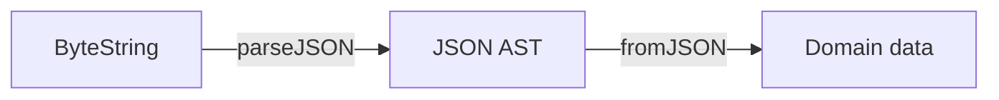

Let's talk about JSON. JSON is everywhere. Rare are the programming languages that do not have a library for serialising data to JSON and parsing JSON data.

Many libraries implement this using an intermediate representation (IR), usually the AST of the JSON object. 
If we are careful about performance, this can be problematic: relying on an IR means extra allocation and computing, slowing down the entire process…

In this post, I will show a way to parse JSON objects without using an IR, by using _partially-initialised data_.

I'll be using Haskell, but it should be possible to implement the approach presented here in languages that support algebraic data types (ADT) and staged meta-programming, like Rust.

## Parsing JSON Data: The Naive Way

But first, let's see what a 'naive' JSON parser roughly looks like.
We'll start by defining the AST type for JSON:

```haskell
import Data.Text (Text)
import Data.Map (Map)

data JSON = Number Number | Bool Bool | List [JSON]
            Null Null | String String | Object Object

newtype String = String Text
data Number = ...
data Null = Null
newtype Object = Object (Map Text JSON)
```

Then, using a parser combinator library, we can write parsers:

```haskell
parseNumber :: Parser Number
parseBool :: Parser Bool
parseNull :: Parser Null
parseString :: Parser String
parseObject :: Parser Object
parseList :: Parser [JSON]

parseJSON :: Parser JSON
parseJSON = (Number <$> parseNumber) <|> (Bool <$> parseBool) 
        <|> (Null <$ parseNull) ...
```

Finally, for each data type that we wish to parse from a JSON value, we define a function that builds said data using a `JSON` value:

```haskell
data Album = Album { 
  title :: T.Text, 
  artistName :: Maybe T.Text, 
  songCount :: Int 
}

fromJSON :: JSON -> Maybe Album
fromJSON = \case
    Object obj -> do
      title <- obj !? "title" 
      artistName <- obj !? "artist_name" 
      songCount <- obj !? "song_count"
      return Album{..}
    _ -> Nothing
```

Thankfully, functions like `fromJSON` can be derived using Template Haskell or Generics (see [makeToJSON](https://hackage-content.haskell.org/package/aeson/docs/Data-Aeson-TH.html#v:deriveFromJSON) and [genericToJSON](https://hackage-content.haskell.org/package/aeson/docs/Data-Aeson.html#v:genericToJSON), respectively).

If we take a step back, we can sum up the data deserialisation process like this:



The second step makes things easier for the developer: by separating the parsing step and the value conversion to our domain data (here `Album`), we end up with code that is easier to maintain. 

## Can we remove this JSON AST from the deserialisation process?

As I said in the intro, relying on a JSON AST (which acts as an IR) means allocating an additional object (the AST) in memory (whose size will be _at least_ as big as the final object), as well as extra computing (when converting this AST to `Album`).

So I asked myself these questions:

- Can we remove this IR? 
- Will the speed-ups be noticeable/consequential? 
- Would we still be able to derive some code automatically/programmatically?
- What about safety?

_Safety_, in the context of data deserialisation, means being able to recover from errors. Such errors can be:

- A (non-nullable) field is missing in the serialised object
- A field's type in the serialised object does not match the one in the data type definition

Additionally, parsers should be able to skip through _unknown_ fields (i.e. fields that are present in the serialised object, but absent from the data type's definition).

So the final question is: Can we still parse data _safely_ without an IR ?

## Solution: partially-initalised objects and explicit field counter


What if we threaded a partially-initalised object, the domain data, and let the parsing function set its fields in the way?

```haskell
parseAlbum :: PartiallyInitalisedAlbum -> Parser PartiallyInitalisedAlbum
```

In Haskell, there are a few ways to represent a partially-initialised value. For example, we could derive a `PartialAlbum` data type where all the fields are wrapped in a `Maybe`, or a data type with a type parameter which says which fields are present or not. Either way, this would mean having to write a function like `PartialAlbum -> Maybe Album`. The problem is that `PartialAlbum` is an IR, so we want to avoid that.

Instead, we will rely on the language's laziness[^1] and set all the object's fields to `undefined`, or at least the ones without a 'default' value. I know, this sounds horrible and unbearably unsafe. But I believe this approach can help the compiler during its optimisation pass.

[^1]: In strict languages, we could instead set the fields to an 'empty' value, e.g. using `memset ` and filling the memory with `0`.

```haskell
album = Album undefined undefined undefined
-- or like this, but the compiler will complain
album = Album{}
```

One important thing to note is that, because of this approach, the domain data type's fields must not be strict!

This raises the next question: how can we check, after the parsing function terminates, that all the fields have been set? 

Evaluating `undefined` raises an error, causing the program to crash, so obviously we cannot do that.

Instead, we can pass around a bit set (let's say a `Word64`), set to `maxBound`, which we will update after a field is set, by clear the bit at position `n`, where `n` is the position of the field in the data type's definition. 

This way, once the parser terminates, we can simply check is this bit set equals 0 to check if the object's fully initialised.

```haskell
parseAlbum :: Parser Album
parseAlbum = case runParser (go Album{} maxBound) of
  (a, 0) -> return a
  (_, bits) -> fail ...
  where go :: Album -> BitSet -> Parser (Album, BitSet)
```

In the `fail` branch, we can check each bit in `bits` and build an error message listing the missing fields.
If all the remaining bits set are for fields whose type is wrapped in `Maybe`, we can set these field to `Nothing` and return a success.

The `go` function could be implemented like this:

```haskell
import Data.Bit (clearBit)

go :: Album -> BitSet -> Parser (Album, BitSet)
go album bitset = do
  char '{'
  res <- manyWithSep (char ',') go' (album, bitset)
  char '}'
  return res

-- | Running go'' until the end of the object 
manyWithSep :: Parser () -> (a -> Parser a) -> a -> Parser a
manyWithSep sep parser state = do
  res<-parser state
  either (pure res) (manyWithSep sep parser res) (try sep)

go'' :: Album -> BitSet -> Parser (Album, BitSet)
go'' album bitset = do
  fieldName <- parseString
  char ':'
  case fieldName of
    "title" -> do
      title <- parseString
      return (album{title=title}, (bitset `clearBit` 0))
    "artist_name" -> do
      artistName <- parseString
      return (album{artistName=artistName}, (bitset `clearBit` 1))
    "song_count" -> do
      songCount <- parseInt
      return (album{songCount=songCount}, (bitset `clearBit` 2))
```


It is easy to observe in `go''` that the pattern match expression's structure can be derived from the source data type, e.g. using Template Haskell.

Of course there are a few things we need to consider, like white spaces in the byte string, error recovery when the field is a `Maybe`, etc.
This code snippet voluntarily omits this for the sake of conciseness.


## Implementation

I implemented this approach using the [`flatparse` library](https://hackage.haskell.org/package/flatparse), and relied on Template Haskell to generate the specialised parsers at compile time.

  The source code is available on [GitHub](https://github.com/Arthi-chaud/serth/tree/main/serth-json-parser). The library relies on another package from the same repository, which abstracts how we retrieve information about an ADT using its name. It is not really relevant here, so I will not go into much detail here.

I should note that the parser for scalar values is not 100% compliant: the handling of escaped characters in strings is incomplete, and only a subset of formats for numbers are supported. However, it being just a proof-of-concept, I believe it is acceptable and enough to evaluate it.

## Benchmarks

To evaluate this approach, I run a few benchmark cases, using [Criterion](https://hackage.haskell.org/package/criterion)[^2].

[^2]: Hardware used: Intel machine, 2 Xeon Gold 6244 CPUs @ 3.60 GHz, 32Gb of RAM, Ubuntu 22.04 LTS

The code for the benchmarks, along with the full benchmark results, is also on [GitHub](https://github.com/Arthi-chaud/serth/blob/main/serth-json-parser/benchmark/Main.hs)

I'll focus on the benchmark case in which we parse objects (with a size similar to `Album`'s).
Keep in mind that these are micro-benchmarks, they may not reflect performance in real-world applications.

I ran the benchmark against code that uses:

- [`aeson`](https://hackage.haskell.org/package/aeson), _the_ JSON library for Haskell, which uses an IR.
- This library, without IR
- This library, but first parsing the object to a generic `JSON` object and using a handwritten `fromJSON` function.

The reason for the latter is to help isolate the cost of the IR. Our JSON parser is very different from `aeson`'s: ours is probably slower, but `aeson` supports customisation options[^3], which can impact the runtime performance. As of today, the library does not support such options.


[^3]: Such as customising the casing of the field names.

| Lib/ Object      | Book     | Author w/ list of books |
|------------------|----------|-------------------------|
| Aeson (w/ IR)    | 1.051 μs |         2.901 μs        |
| Our Lib (w/ IR)  | 922.7 ns |         2.813 μs        |
| Our Lib (w/o IR) | 314.2 ns |         1.027 μs        |


The difference in performance between code that uses an IR and code that does not is quite significant. When using an IR, parsing appears to be ~3 times slower.
This confirms that the IR does have an impact on performance.


## Conclusion

Of course, our implementation is not perfect and lacks features from a real-world parser which could impact performance, most notably customisations options. 
Such options allow defining the behaviour on missing fields, defining the casing of the object's fields, handling of ADTs, etc.

The goal of this post is not so shame libraries like `aeson` for relying on IRs. 
IRs _are_ useful and allow decoupling the parsing process from the validation step. Our approach merges both, and makes the code more complex and less maintainable but significantly faster. 

Instead, I wanted to highlight the cost of IRs at runtime, and how they can impact performance, as well as showcase a (arguably less elegant) solution to avoid them.

The impact of IRs on performance is not new knowledge. Rust's serialisation framework `serde` leverages staged programming to lift that IR to compile-time.


